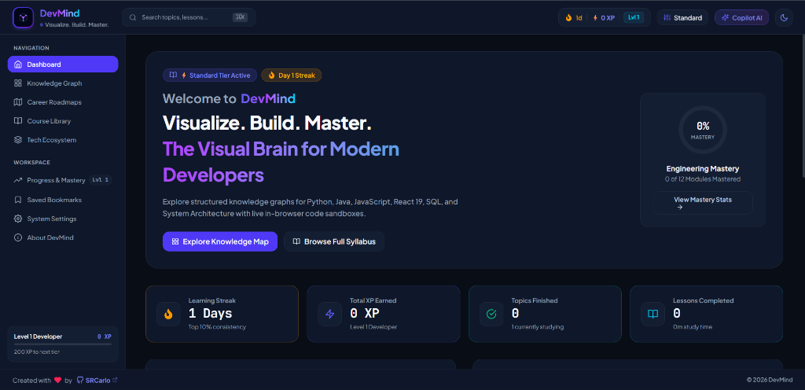
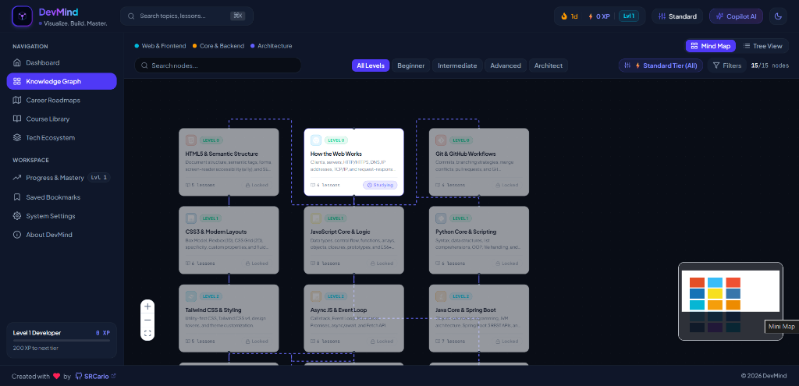
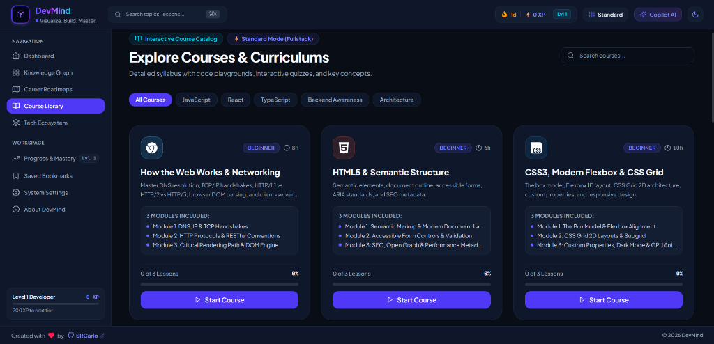
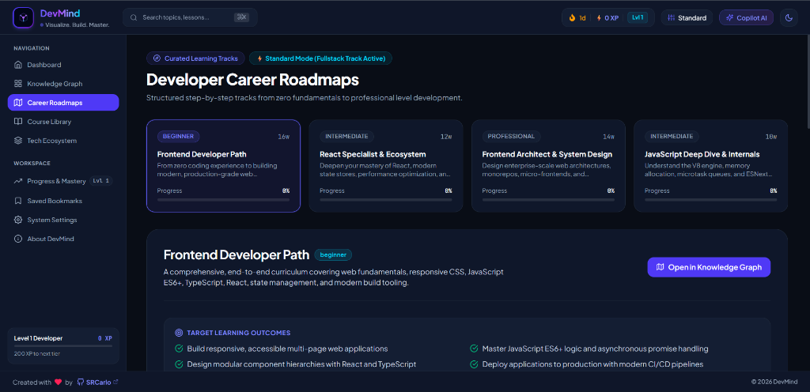
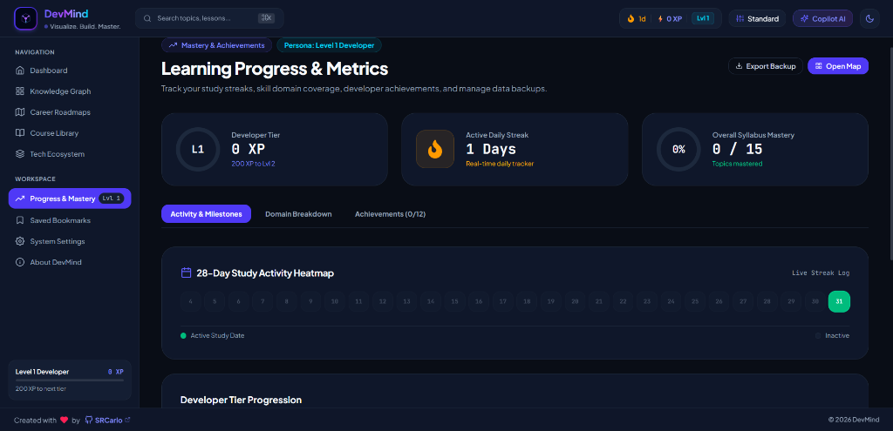

<div align="center">

# 🧠 DevMind
### *The Visual Brain for Modern Software Developers*

[](https://react.dev)
[](https://www.typescriptlang.org)
[](https://vitejs.dev)
[](https://tailwindcss.com)
[](https://reactflow.dev)
[](LICENSE)

<br/>

**DevMind** is a production-grade, client-side interactive software engineering learning platform. It visualizes developer education through an interactive visual knowledge graph, curated career roadmaps, simulated sandbox playgrounds, interactive quizzes, gamified progression (XP, levels, study streaks), and an intelligent context-aware AI copilot.

<br/>



</div>

---

## 📸 Platform Previews & Screenshots

### 1. 🗺️ Interactive Knowledge Graph
Explore interconnected concept nodes with explicit dependency prerequisites, difficulty levels (Level 0: Beginner to Level 4: Pro Architect), and dynamic Experience Tier filtering.



---

### 2. 📚 Complete Multi-Module Course Curriculums
Deep-dive into multi-module course tracks with conceptual breakdowns, interactive executable code sandboxes, and knowledge check quizzes.



---

### 3. 🧭 Developer Career Roadmaps
Structured step-by-step tracks from zero fundamentals to professional software engineering (Frontend Path, React Specialist, Frontend Architect, JavaScript Internals).



---

### 4. 📊 Gamification, Mastery & 28-Day Heatmap
Track your learning consistency with an active daily streak heatmap, XP rewards, developer tier progression ladder, unlockable achievements, and JSON backup tools.



---

## 🌟 Key Features & Capabilities

- **🗺️ Interactive Synapse Graph Canvas (`/mindmap`)**:
  - Powered by `@xyflow/react` with smooth zooming, panning, and minimap navigation.
  - Adaptive node styling with level badges, category pills, glowing active indicators, and dependency validation.
  - **Dynamic Experience Tiers**: Seamlessly switch between `🌱 Beginner Mode` (Level 0-1), `⚡ Standard Mode` (All Levels), and `🏛️ Pro Architect Mode` (Level 2-4).

- **💻 In-Browser Code Sandboxes (`/learn/:topicId/:lessonId`)**:
  - Real-time JavaScript execution with safe AST interpretation and simulated browser environment.
  - Interactive knowledge quizzes with XP rewards, detailed technical explanations, and confetti animations.
  - Local persistent notes saved directly in browser storage.

- **🚀 25-Second Developer Evolution Intro**:
  - Connected neural dots matrix visualizing the journey from *Student / Absolute Beginner* to *Principal Software Architect*.

- **🔍 Global Command Palette (`⌘K` / `Ctrl+K`)**:
  - Instant fuzzy search across topics, courses, lessons, roadmaps, and technologies with keyboard navigation.

- **💾 100% Client-Side Privacy & Offline First**:
  - Zero backend required. All notes, streak history, XP, and bookmarks remain secure in local storage with one-click JSON backup export and file restore.

---

## 🛠️ Technology Stack

| Layer | Technologies |
| :--- | :--- |
| **Frontend Framework** | React 19, TypeScript 5, Vite 8 |
| **Interactive Graph** | `@xyflow/react` (ReactFlow v12) |
| **Styling & Design System** | Tailwind CSS v4, Modern Design Tokens, Glassmorphism |
| **Animations & UI** | Framer Motion, Canvas Confetti, Lucide / React Icons |
| **State & Persistence** | React Context + LocalStorage Architecture |

---

## 🚀 Quick Start & Local Development

### 1. Clone the Repository
```bash
git clone https://github.com/SRCarlo/devmind.git
cd devmind
```

### 2. Install Dependencies
```bash
npm install
```

### 3. Start the Development Server
```bash
npm run dev
```
Open your browser at `http://localhost:5173`.

### 4. Build for Production
```bash
npm run build
```

---

## 📂 Project Architecture

```
devmind/
├── docs/
│   └── images/              # High-resolution platform preview screenshots
├── public/                  # Static assets and icons
├── src/
│   ├── app/                 # Root App component, router, and context providers
│   ├── components/
│   │   ├── ai/              # AI Copilot assistant drawer
│   │   ├── dashboard/       # Hero banner, stats overview, skill breakdown
│   │   ├── layout/          # AppShell, Navbar, Sidebar, Footer
│   │   ├── learning/        # CodePlayground, LessonViewer, QuizComponent, NotesEditor
│   │   ├── mindmap/         # MindMapCanvas, MindMapControls, NodeDetailsDrawer
│   │   ├── search/          # CommandPalette (⌘K)
│   │   └── ui/              # Button, Badge, Modal, DangerConfirmModal, IntroSplash
│   ├── data/                # Courses, mindmap topics, roadmaps, tech items, achievements
│   ├── pages/               # Dashboard, MindMap, Courses, Roadmaps, Progress, Tech, Settings
│   ├── types/               # TypeScript interfaces (Learning, MindMap, Progress)
│   ├── utils/               # Icon mappers and helper utilities
│   ├── index.css            # Tailwind CSS v4 design tokens and theme rules
│   └── main.tsx             # Application bootstrap entry point
├── package.json
├── tsconfig.json
└── vite.config.ts
```

---

## 📄 License
This project is licensed under the [MIT License](LICENSE).

<div align="center">
  <sub>Built with ❤️ by <a href="https://github.com/SRCarlo">SRCarlo</a></sub>
</div>
